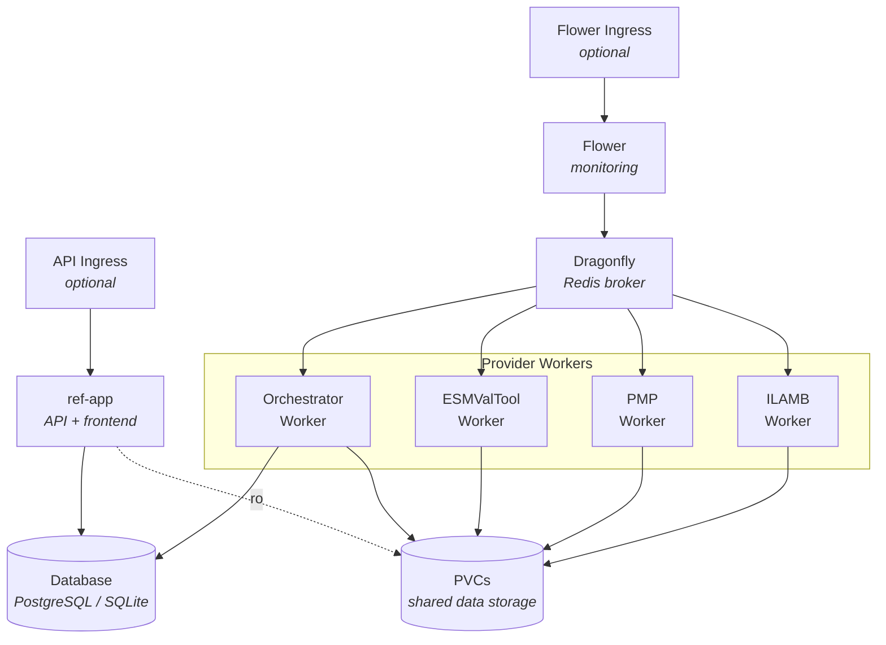

# Climate REF Helm Chart

A Helm chart for deploying the Climate REF (Rapid Evaluation Framework) on Kubernetes.
This chart deploys the full stack:

- the ref-app API/website
- celery monitoring UI
- distributed Celery workers for running climate diagnostics.

## Overview

The chart deploys:

- **ref-app (API)**: FastAPI application serving the REST API and static React frontend
- **Dragonfly** (Redis-compatible): Message broker and result backend for Celery
- **Flower**: Web UI for monitoring Celery tasks
- **Provider Workers**: Celery workers for each diagnostic provider (orchestrator, esmvaltool, pmp, ilamb)

## Prerequisites

- Kubernetes 1.19+
- Helm 3.0+
- Access to container images:
  - `ghcr.io/climate-ref/climate-ref-frontend`
  - `ghcr.io/climate-ref/climate-ref`
  - `mher/flower`

## Versioning

This chart uses **coupled versioning**: the chart version, appVersion, and default image tag are all kept in sync with the main application version.

## Installation

### Add the chart repository

```bash
# If published to a Helm repository
helm repo add climate-ref-aft <repository-url>
helm repo update
```

### Install the chart

```bash
# Install with default values
helm install ref ./helm

# Install with custom values
helm install ref ./helm -f my-values.yaml

# Install in a specific namespace
helm install ref ./helm -n climate-ref --create-namespace
```

### Update dependencies

```bash
cd helm
helm dependency update
```

## Architecture



### Provider Workers

Each provider worker listens to a specific Celery queue:

| Provider     | Queue              | Description                       |
| ------------ | ------------------ | --------------------------------- |
| orchestrator | `celery` (default) | Coordinates diagnostic execution  |
| esmvaltool   | `esmvaltool`       | ESMValTool diagnostics            |
| pmp          | `pmp`              | PCMDI Metrics Package diagnostics |
| ilamb        | `ilamb`            | ILAMB diagnostics                 |

## Configuration

### Global Parameters

| Parameter          | Description                | Default |
| ------------------ | -------------------------- | ------- |
| `imagePullSecrets` | Docker registry secrets    | `[]`    |
| `nameOverride`     | Override chart name        | `""`    |
| `fullnameOverride` | Override full release name | `""`    |

### API Configuration

The `api` section configures the ref-app (FastAPI + React frontend).

| Parameter              | Description               | Default                                    |
| ---------------------- | ------------------------- | ------------------------------------------ |
| `api.enabled`          | Enable the API deployment | `true`                                     |
| `api.replicaCount`     | Number of API replicas    | `1`                                        |
| `api.image.repository` | API image repository      | `ghcr.io/climate-ref/climate-ref-frontend` |
| `api.image.tag`        | API image tag             | `main`                                     |
| `api.image.pullPolicy` | Image pull policy         | `IfNotPresent`                             |
| `api.service.type`     | Service type              | `ClusterIP`                                |
| `api.service.port`     | Service port              | `80`                                       |
| `api.resources`        | Resource requests/limits  | `{}`                                       |
| `api.nodeSelector`     | Node selector             | `{}`                                       |
| `api.tolerations`      | Tolerations               | `[]`                                       |
| `api.affinity`         | Affinity rules            | `{}`                                       |

#### API Environment Variables

Set via `api.env`:

| Variable            | Description                    | Default                           |
| ------------------- | ------------------------------ | --------------------------------- |
| `ENVIRONMENT`       | Runtime environment            | `production`                      |
| `LOG_LEVEL`         | Logging level                  | `INFO`                            |
| `SECRET_KEY`        | Application secret key         | `changethis` (override in prod!)  |
| `REF_DATABASE_URL`  | Database connection string     | `""` (required)                   |
| `REF_CONFIGURATION` | Path to REF configuration      | `/app/.ref`                       |

#### API Ingress

| Parameter                  | Description         | Default |
| -------------------------- | ------------------- | ------- |
| `api.ingress.enabled`      | Enable API ingress  | `false` |
| `api.ingress.host`         | Ingress hostname    | `""`    |
| `api.ingress.className`    | Ingress class name  | `""`    |
| `api.ingress.annotations`  | Ingress annotations | `{}`    |
| `api.ingress.labels`       | Ingress labels      | `{}`    |

#### API HTTPRoute (Gateway API)

| Parameter                    | Description                  | Default |
| ---------------------------- | ---------------------------- | ------- |
| `api.httpRoute.enabled`      | Enable API HTTPRoute         | `false` |
| `api.httpRoute.hostnames`    | List of hostnames to match   | `[]`    |
| `api.httpRoute.parentRefs`   | Gateway parent references    | `[]`    |
| `api.httpRoute.annotations`  | HTTPRoute annotations        | `{}`    |
| `api.httpRoute.labels`       | HTTPRoute labels             | `{}`    |

### Dragonfly (Redis) Configuration

| Parameter                   | Description               | Default |
| --------------------------- | ------------------------- | ------- |
| `dragonfly.enabled`         | Enable Dragonfly subchart | `true`  |
| `dragonfly.storage.enabled` | Enable persistent storage | `true`  |

See [Dragonfly Helm chart](https://github.com/dragonflydb/dragonfly/tree/main/contrib/charts/dragonfly) for all available options.

### Flower Configuration

| Parameter                       | Description                      | Default        |
| ------------------------------- | -------------------------------- | -------------- |
| `flower.replicaCount`           | Number of Flower replicas        | `1`            |
| `flower.image.repository`       | Flower image repository          | `mher/flower`  |
| `flower.image.tag`              | Flower image tag                 | `2.0.1`        |
| `flower.image.pullPolicy`       | Image pull policy                | `IfNotPresent` |
| `flower.service.type`           | Service type                     | `ClusterIP`    |
| `flower.service.port`           | Service port                     | `5555`         |
| `flower.serviceMonitor.enabled` | Enable Prometheus ServiceMonitor | `false`        |
| `flower.resources`              | Resource requests/limits         | `{}`           |
| `flower.nodeSelector`           | Node selector                    | `{}`           |
| `flower.tolerations`            | Tolerations                      | `[]`           |
| `flower.affinity`               | Affinity rules                   | `{}`           |

#### Flower Ingress

| Parameter                     | Description             | Default |
| ----------------------------- | ----------------------- | ------- |
| `flower.ingress.enabled`      | Enable Flower ingress   | `false` |
| `flower.ingress.host`         | Ingress hostname        | `""`    |
| `flower.ingress.className`    | Ingress class name      | `""`    |
| `flower.ingress.annotations`  | Ingress annotations     | `{}`    |
| `flower.ingress.labels`       | Ingress labels          | `{}`    |

#### Flower HTTPRoute (Gateway API)

| Parameter                       | Description                  | Default |
| ------------------------------- | ---------------------------- | ------- |
| `flower.httpRoute.enabled`      | Enable Flower HTTPRoute      | `false` |
| `flower.httpRoute.hostnames`    | List of hostnames to match   | `[]`    |
| `flower.httpRoute.parentRefs`   | Gateway parent references    | `[]`    |
| `flower.httpRoute.annotations`  | HTTPRoute annotations        | `{}`    |
| `flower.httpRoute.labels`       | HTTPRoute labels             | `{}`    |

### Provider Defaults

These defaults apply to all providers unless overridden per-provider.

| Parameter                   | Description               | Default                           |
| --------------------------- | ------------------------- | --------------------------------- |
| `defaults.replicaCount`     | Number of worker replicas | `1`                               |
| `defaults.image.repository` | Worker image repository   | `ghcr.io/climate-ref/climate-ref` |
| `defaults.image.tag`        | Worker image tag          | `v0.11.1`                         |
| `defaults.image.pullPolicy` | Image pull policy         | `IfNotPresent`                    |
| `defaults.resources`        | Resource requests/limits  | `{}`                              |
| `defaults.nodeSelector`     | Node selector             | `{}`                              |
| `defaults.tolerations`      | Tolerations               | `[]`                              |
| `defaults.affinity`         | Affinity rules            | `{}`                              |
| `defaults.volumes`          | Additional volumes        | `[]`                              |
| `defaults.volumeMounts`     | Additional volume mounts  | `[]`                              |

### Provider-Specific Overrides

Each provider under `providers.*` can override any default setting:

```yaml
providers:
  orchestrator: {}              # Uses all defaults
  esmvaltool:
    replicaCount: 2             # Override replica count
    resources:
      requests:
        memory: "2Gi"
        cpu: "1"
  pmp: {}
  ilamb: {}
```

### Environment Variables

Environment variables can be set via `defaults.env` or per-provider:

| Variable                | Description               | Default                                      |
| ----------------------- | ------------------------- | -------------------------------------------- |
| `CELERY_BROKER_URL`     | Redis broker URL          | Auto-configured to Dragonfly                 |
| `CELERY_RESULT_BACKEND` | Redis result backend URL  | Auto-configured to Dragonfly                 |
| `CELERY_ACCEPT_CONTENT` | Accepted content types    | `["json", "pickle"]`                         |
| `REF_EXECUTOR`          | Executor class            | `climate_ref_celery.executor.CeleryExecutor` |
| `HOME`                  | Home directory (writable) | `/tmp`                                       |

### Celery Reliability Settings

These settings control worker crash recovery and task time limits to ensure that the celery tasks
are durable and do not result in hanging consumers.
They have sensible defaults in `celeryconf/base.py` and can be overridden
via environment variables globally (in `defaults.env`) or per-provider.

If tasks are hanging or not resolving, then the celery configuration could be the issue.
We need to be resiliant to workers failing.

| Variable                            | Description                                      | Default             |
| ----------------------------------- | ------------------------------------------------ | ------------------- |
| `CELERY_TASK_TIME_LIMIT`            | Hard kill timeout in seconds                     | `21600` (6 hours)   |
| `CELERY_TASK_SOFT_TIME_LIMIT`       | Soft timeout (raises exception for cleanup)      | `19800` (5.5 hours) |
| `CELERY_TASK_MAX_RETRIES`           | Max retries before permanent failure             | `2`                 |
| `CELERY_VISIBILITY_TIMEOUT`         | Redis redelivery timeout (must be >= time limit) | Matches time limit  |
| `CELERY_WORKER_PREFETCH_MULTIPLIER` | Tasks prefetched per worker process              | `1`                 |
| `CELERY_WORKER_CONCURRENCY`         | Worker processes per pod                         | CPU count           |
| `CELERY_RESULT_EXPIRES`             | Result expiry in seconds                         | `172800` (48 hours) |
| `CELERY_WORKER_MAX_TASKS_PER_CHILD` | Recycle worker after N tasks (memory leak guard) | None (no limit)     |
| `CELERY_WORKER_MAX_MEMORY_PER_CHILD`| Max resident memory per worker in KB             | None (no limit)     |

The following settings are always enabled in `base.py` and cannot be overridden via
environment variables:

| Setting                                              | Value  | Purpose                                                         |
| ---------------------------------------------------- | ------ | --------------------------------------------------------------- |
| `task_acks_late`                                     | `True` | ACK after execution so crashed tasks are redelivered            |
| `task_reject_on_worker_lost`                         | `True` | SIGKILL causes redelivery instead of silent loss                |
| `task_track_started`                                 | `True` | Distinguish "not started" from "worker died" in Flower          |
| `worker_cancel_long_running_tasks_on_connection_loss`| `True` | Kill tasks on broker disconnect to prevent duplicate execution  |
| `worker_send_task_events`                            | `True` | Emit task events for Flower monitoring                          |
| `result_extended`                                    | `True` | Store extra metadata (task name, args, worker) with results     |
| `result_backend_always_retry`                        | `True` | Retry result storage on transient Redis errors                  |

#### Per-Provider Time Limits

Providers have different runtime characteristics. Override time limits per-provider
to avoid unnecessarily long visibility windows on fast providers:

```yaml
providers:
  esmvaltool:
    env:
      # ESMValTool diagnostics can run for hours
      CELERY_TASK_TIME_LIMIT: "21600"        # 6 hours
      CELERY_TASK_SOFT_TIME_LIMIT: "19800"   # 5.5 hours
      CELERY_VISIBILITY_TIMEOUT: "21600"
  ilamb:
    env:
      # ILAMB diagnostics are typically fast
      CELERY_TASK_TIME_LIMIT: "1800"         # 30 minutes
      CELERY_TASK_SOFT_TIME_LIMIT: "1500"    # 25 minutes
      CELERY_VISIBILITY_TIMEOUT: "1800"
  pmp:
    env:
      CELERY_TASK_TIME_LIMIT: "7200"         # 2 hours
      CELERY_TASK_SOFT_TIME_LIMIT: "6600"    # 1 hour 50 min
      CELERY_VISIBILITY_TIMEOUT: "7200"
```

**Important:** `CELERY_VISIBILITY_TIMEOUT` must always be >= `CELERY_TASK_TIME_LIMIT`.
If a task runs longer than the visibility timeout,
Redis will redeliver it to another worker, causing duplicate execution. See the `celeryconf/base.py` docstring for details.

### Persistent Volume Claims

Create PVCs using the `createPVCs` map:

```yaml
createPVCs:
  data: 100Gi
  results: 50Gi
```

Mount them in providers:

```yaml
defaults:
  volumes:
    - name: data
      persistentVolumeClaim:
        claimName: ref-data
  volumeMounts:
    - name: data
      mountPath: /data
```

### Autoscaling

Enable horizontal pod autoscaling per provider:

```yaml
providers:
  esmvaltool:
    autoscaling:
      enabled: true
      minReplicas: 1
      maxReplicas: 10
      targetCPUUtilizationPercentage: 80
```

The HPA uses a custom metric (`flower_task_prefetch_time_seconds`) to scale based on queue depth.

## Security

The chart implements security best practices:

- **Read-only root filesystem**: All containers use read-only root filesystems
- **Non-root user**: All containers run as non-root
- **Dropped capabilities**: All Linux capabilities are dropped
- **Service account tokens**: Automounting disabled by default
- **Pod security context**: `fsGroup: 1000` for shared file access

## Troubleshooting

### Workers not starting

Check if workers output startup logs. If no logs appear, the container likely failed to start:

```bash
kubectl logs -l app.kubernetes.io/component=orchestrator
kubectl describe pod -l app.kubernetes.io/component=orchestrator
```

### HOME directory issues

Some libraries (intake-esgf, ilamb3) require a writable HOME directory. The chart sets `HOME=/tmp` by default. Ensure `/tmp` is writable:

```yaml
defaults:
  volumes:
    - name: tmp
      emptyDir: {}
  volumeMounts:
    - name: tmp
      mountPath: /tmp
```

### Connection to Dragonfly failing

Verify Dragonfly is running:

```bash
kubectl get pods -l app.kubernetes.io/name=dragonfly
kubectl logs -l app.kubernetes.io/name=dragonfly
```

### Monitoring with Flower

Access Flower UI:

```bash
kubectl port-forward svc/<release-name>-climate-ref-aft-flower 5555:5555
```

Open <http://localhost:5555> in your browser.

### Accessing the API

Access the ref-app API:

```bash
kubectl port-forward svc/<release-name>-climate-ref-aft-api 8000:80
```

Open <http://localhost:8000> in your browser, or check the health endpoint:

```bash
curl http://localhost:8000/api/v1/utils/health-check/
```

## Resources Created

The chart creates the following Kubernetes resources:

| Resource                | Count           | Description                        |
| ----------------------- | --------------- | ---------------------------------- |
| Deployment              | 2 + N providers | API + Flower + one per provider    |
| Service                 | 3               | API + Flower + Dragonfly           |
| ServiceAccount          | 2 + N providers | API + Flower + one per provider    |
| Secret                  | 2 + N providers | Environment config per component   |
| ServiceMonitor          | 0-1             | Optional Prometheus integration    |
| HorizontalPodAutoscaler | 0-N             | Optional per-provider              |
| PersistentVolumeClaim   | N               | As configured in createPVCs        |
| Ingress                 | 0-2             | Optional API and/or Flower ingress |
| HTTPRoute               | 0-2             | Optional Gateway API routes        |
