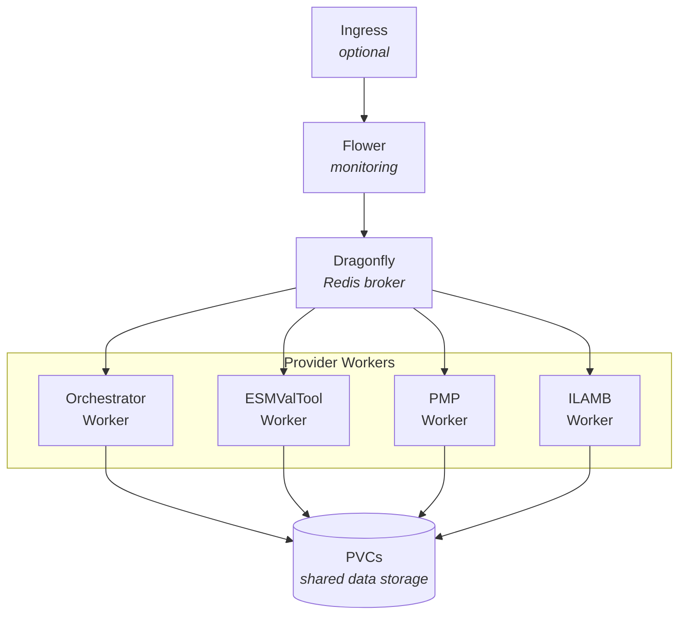

# Climate REF Helm Chart

A Helm chart for deploying the Climate REF (Rapid Evaluation Framework) on Kubernetes.
This chart deploys a distributed task execution system using Celery workers for running climate diagnostics.

## Overview

The chart deploys:

- **Dragonfly** (Redis-compatible): Message broker and result backend for Celery
- **Flower**: Web UI for monitoring Celery tasks
- **Provider Workers**: Celery workers for each diagnostic provider (orchestrator, esmvaltool, pmp, ilamb, example)

## Prerequisites

- Kubernetes 1.19+
- Helm 3.0+
- Access to container images:
  - `ghcr.io/climate-ref/climate-ref`
  - `mher/flower`

## Versioning

This chart uses **coupled versioning**: the chart version, appVersion, and default image tag are all kept in sync with the main application version.

## Installation

### Add the chart repository

```bash
# If published to a Helm repository
helm repo add climate-ref <repository-url>
helm repo update
```

### Install the chart

```bash
# Install with default values
helm install ref ./helm

# Install with custom values
helm install ref ./helm -f my-values.yaml

# Install in a specific namespace
helm install ref ./helm -n climate-ref --create-namespace
```

### Update dependencies

```bash
cd helm
helm dependency update
```

## Architecture



### Provider Workers

Each provider worker listens to a specific Celery queue:

| Provider     | Queue              | Description                       |
| ------------ | ------------------ | --------------------------------- |
| orchestrator | `celery` (default) | Coordinates diagnostic execution  |
| esmvaltool   | `esmvaltool`       | ESMValTool diagnostics            |
| pmp          | `pmp`              | PCMDI Metrics Package diagnostics |
| ilamb        | `ilamb`            | ILAMB diagnostics                 |
| example      | `example`          | Example provider for testing      |

## Configuration

### Global Parameters

| Parameter          | Description                | Default |
| ------------------ | -------------------------- | ------- |
| `imagePullSecrets` | Docker registry secrets    | `[]`    |
| `nameOverride`     | Override chart name        | `""`    |
| `fullnameOverride` | Override full release name | `""`    |

### Ingress Configuration

| Parameter             | Description         | Default |
| --------------------- | ------------------- | ------- |
| `ingress.enabled`     | Enable ingress      | `false` |
| `ingress.host`        | Ingress hostname    | `""`    |
| `ingress.className`   | Ingress class name  | `""`    |
| `ingress.annotations` | Ingress annotations | `{}`    |
| `ingress.labels`      | Ingress labels      | `{}`    |

### Dragonfly (Redis) Configuration

| Parameter                   | Description                 | Default |
| --------------------------- | --------------------------- | ------- |
| `dragonfly.enabled`         | Enable Dragonfly deployment | `true`  |
| `dragonfly.storage.enabled` | Enable persistent storage   | `true`  |

See [Dragonfly Helm chart](https://github.com/dragonflydb/dragonfly/tree/main/contrib/charts/dragonfly) for all available options.

### Flower Configuration

| Parameter                       | Description                      | Default        |
| ------------------------------- | -------------------------------- | -------------- |
| `flower.replicaCount`           | Number of Flower replicas        | `1`            |
| `flower.image.repository`       | Flower image repository          | `mher/flower`  |
| `flower.image.tag`              | Flower image tag                 | `2.0.1`        |
| `flower.image.pullPolicy`       | Image pull policy                | `IfNotPresent` |
| `flower.service.type`           | Service type                     | `ClusterIP`    |
| `flower.service.port`           | Service port                     | `5555`         |
| `flower.serviceMonitor.enabled` | Enable Prometheus ServiceMonitor | `false`        |
| `flower.resources`              | Resource requests/limits         | `{}`           |
| `flower.nodeSelector`           | Node selector                    | `{}`           |
| `flower.tolerations`            | Tolerations                      | `[]`           |
| `flower.affinity`               | Affinity rules                   | `{}`           |

### Provider Defaults

These defaults apply to all providers unless overridden per-provider.

| Parameter                   | Description               | Default                           |
| --------------------------- | ------------------------- | --------------------------------- |
| `defaults.replicaCount`     | Number of worker replicas | `1`                               |
| `defaults.image.repository` | Worker image repository   | `ghcr.io/climate-ref/climate-ref` |
| `defaults.image.tag`        | Worker image tag          | `v0.9.1`                          |
| `defaults.image.pullPolicy` | Image pull policy         | `IfNotPresent`                    |
| `defaults.resources`        | Resource requests/limits  | `{}`                              |
| `defaults.nodeSelector`     | Node selector             | `{}`                              |
| `defaults.tolerations`      | Tolerations               | `[]`                              |
| `defaults.affinity`         | Affinity rules            | `{}`                              |
| `defaults.volumes`          | Additional volumes        | `[]`                              |
| `defaults.volumeMounts`     | Additional volume mounts  | `[]`                              |

### Provider-Specific Overrides

Each provider under `providers.*` can override any default setting:

```yaml
providers:
  orchestrator: {}              # Uses all defaults
  esmvaltool:
    replicaCount: 2             # Override replica count
    resources:
      requests:
        memory: "2Gi"
        cpu: "1"
  pmp: {}
  ilamb: {}
  example: {}
```

### Environment Variables

Environment variables can be set via `defaults.env` or per-provider:

| Variable                | Description               | Default                                      |
| ----------------------- | ------------------------- | -------------------------------------------- |
| `CELERY_BROKER_URL`     | Redis broker URL          | Auto-configured to Dragonfly                 |
| `CELERY_RESULT_BACKEND` | Redis result backend URL  | Auto-configured to Dragonfly                 |
| `CELERY_ACCEPT_CONTENT` | Accepted content types    | `["json", "pickle"]`                         |
| `REF_EXECUTOR`          | Executor class            | `climate_ref_celery.executor.CeleryExecutor` |
| `HOME`                  | Home directory (writable) | `/tmp`                                       |

### Persistent Volume Claims

Create PVCs using the `createPVCs` map:

```yaml
createPVCs:
  data: 100Gi
  results: 50Gi
```

Mount them in providers:

```yaml
defaults:
  volumes:
    - name: data
      persistentVolumeClaim:
        claimName: ref-data
  volumeMounts:
    - name: data
      mountPath: /data
```

### Autoscaling

Enable horizontal pod autoscaling per provider:

```yaml
providers:
  esmvaltool:
    autoscaling:
      enabled: true
      minReplicas: 1
      maxReplicas: 10
      targetCPUUtilizationPercentage: 80
```

The HPA uses a custom metric (`flower_task_prefetch_time_seconds`) to scale based on queue depth.

## Security

The chart implements security best practices:

- **Read-only root filesystem**: All containers use read-only root filesystems
- **Non-root user**: All containers run as non-root
- **Dropped capabilities**: All Linux capabilities are dropped
- **Service account tokens**: Automounting disabled by default
- **Pod security context**: `fsGroup: 1000` for shared file access

## Troubleshooting

### Workers not starting

Check if workers output startup logs. If no logs appear, the container likely failed to start:

```bash
kubectl logs -l app.kubernetes.io/component=orchestrator
kubectl describe pod -l app.kubernetes.io/component=orchestrator
```

### HOME directory issues

Some libraries (intake-esgf, ilamb3) require a writable HOME directory. The chart sets `HOME=/tmp` by default. Ensure `/tmp` is writable:

```yaml
defaults:
  volumes:
    - name: tmp
      emptyDir: {}
  volumeMounts:
    - name: tmp
      mountPath: /tmp
```

### Connection to Dragonfly failing

Verify Dragonfly is running:

```bash
kubectl get pods -l app.kubernetes.io/name=dragonfly
kubectl logs -l app.kubernetes.io/name=dragonfly
```

### Monitoring with Flower

Access Flower UI:

```bash
kubectl port-forward svc/ref-flower 5555:5555
```

Open <http://localhost:5555> in your browser.

## Resources Created

The chart creates the following Kubernetes resources:

| Resource                | Count           | Description                      |
| ----------------------- | --------------- | -------------------------------- |
| Deployment              | 1 + N providers | Flower + one per provider        |
| Service                 | 2               | Flower + Dragonfly               |
| ServiceAccount          | 1 + N providers | Flower + one per provider        |
| Secret                  | 1 + N providers | Environment config per component |
| ServiceMonitor          | 0-1             | Optional Prometheus integration  |
| HorizontalPodAutoscaler | 0-N             | Optional per-provider            |
| PersistentVolumeClaim   | N               | As configured in createPVCs      |
| Ingress                 | 0-1             | Optional                         |
