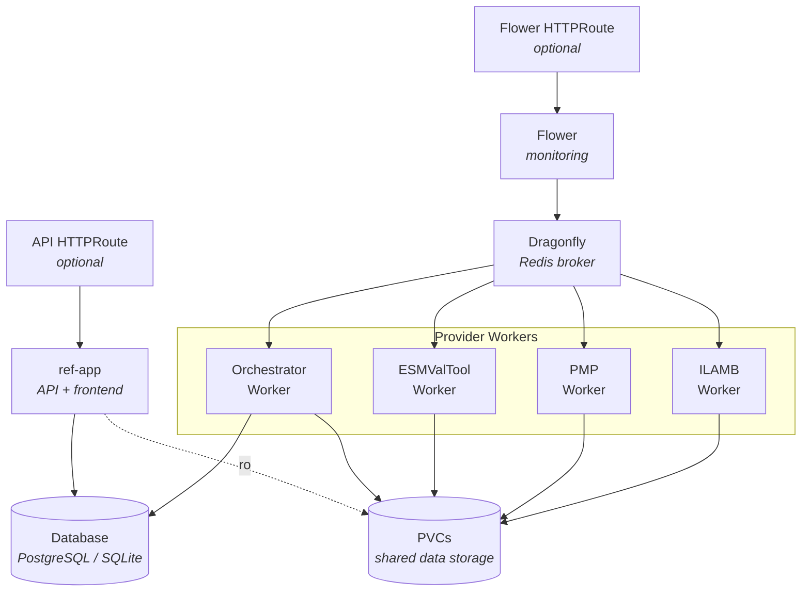

# Climate REF Helm Chart

A Helm chart for deploying the Climate REF (Rapid Evaluation Framework) on Kubernetes.
This chart deploys the full stack:

- the ref-app API/website
- celery monitoring UI
- distributed Celery workers for running climate diagnostics.

## Overview

The chart deploys:

- **ref-app (API)**: FastAPI application serving the REST API and static React frontend
- **Dragonfly** (Redis-compatible): Message broker and result backend for Celery
- **Flower**: Web UI for monitoring Celery tasks
- **Provider Workers**: Celery workers for each diagnostic provider (orchestrator, esmvaltool, pmp, ilamb)

## Prerequisites

- Kubernetes 1.23+ (autoscaling/v2), plus the Gateway API CRDs when using `httpRoute`
- Helm 3.0+
- Access to container images:
  - `ghcr.io/climate-ref/climate-ref-frontend`
  - `ghcr.io/climate-ref/climate-ref`
  - `mher/flower`

## Versioning

This chart uses **coupled versioning**: the chart version, appVersion, and default image tag are all kept in sync with the main application version.

## Installation

### Add the chart repository

```bash
# If published to a Helm repository
helm repo add climate-ref-aft <repository-url>
helm repo update
```

### Install the chart

```bash
# Install with default values
helm install ref ./helm

# Install with custom values
helm install ref ./helm -f my-values.yaml

# Install in a specific namespace
helm install ref ./helm -n climate-ref --create-namespace
```

### Update dependencies

```bash
cd helm
helm dependency update
```

## Architecture


```mermaid
flowchart TB
    apiRoute[API HTTPRoute<br/><i>optional</i>]
    flowerRoute[Flower HTTPRoute<br/><i>optional</i>]
    api[ref-app<br/><i>API + frontend</i>]
    flower[Flower<br/><i>monitoring</i>]
    dragonfly[Dragonfly<br/><i>Redis broker</i>]
    db[(Database<br/><i>PostgreSQL / SQLite</i>)]

    subgraph workers[Provider Workers]
        orchestrator[Orchestrator<br/>Worker]
        esmvaltool[ESMValTool<br/>Worker]
        pmp[PMP<br/>Worker]
        ilamb[ILAMB<br/>Worker]
    end

    pvcs[(PVCs<br/><i>shared data storage</i>)]

    apiRoute --> api
    flowerRoute --> flower
    api --> db
    orchestrator --> db
    flower --> dragonfly
    dragonfly --> orchestrator
    dragonfly --> esmvaltool
    dragonfly --> pmp
    dragonfly --> ilamb
    api -. ro .-> pvcs
    orchestrator --> pvcs
    esmvaltool --> pvcs
    pmp --> pvcs
    ilamb --> pvcs
```

### Provider Workers

Each provider worker listens to a specific Celery queue:

| Provider     | Queue              | Description                       |
| ------------ | ------------------ | --------------------------------- |
| orchestrator | `celery` (default) | Coordinates diagnostic execution  |
| esmvaltool   | `esmvaltool`       | ESMValTool diagnostics            |
| pmp          | `pmp`              | PCMDI Metrics Package diagnostics |
| ilamb        | `ilamb`            | ILAMB diagnostics                 |

## Configuration

### Required volumes

The chart sets environment variables (`HOME`, `REF_CONFIGURATION`, `REF_SOFTWARE_ROOT`) that point at filesystem paths the application expects to read and write.
The default `securityContext.readOnlyRootFilesystem: true` makes those paths fail unless they are explicitly mounted.
You must wire up these volumes in your `values.yaml`, otherwise pods will crash on startup or during `ref providers setup`.

| Path   | Used by                         | Why required                                                                                                               | Suggested backing                             |
| ------ | ------------------------------- | -------------------------------------------------------------------------------------------------------------------------- | --------------------------------------------- |
| `/ref` | API + all workers + migrate Job | `REF_CONFIGURATION` and `REF_SOFTWARE_ROOT=/ref/software`. Holds the config, the conda environments, scratch and results.  | Persistent volume (PVC or shared host mount). |
| `/tmp` | API + all workers + migrate Job | `HOME=/tmp`. Diagnostic libraries (intake-esgf, ilamb3) create config directories on import, and the root FS is read-only.  | `emptyDir: {}` is sufficient.                 |

#### Who writes what

`/ref` is one volume, but the components need very different access to it.
Granting every pod RW on the whole tree works,
but narrowing access means a buggy or compromised diagnostic cannot clobber another provider's conda environment.

| Subpath         | API | Provider workers | Orchestrator | Migrate Job |
| --------------- | --- | ---------------- | ------------ | ----------- |
| `/ref` (config) | RO  | RO               | RO           | RO          |
| `/ref/software` | RO  | RO               | RW           | —           |
| `/ref/scratch`  | —   | RW               | RW           | —           |
| `/ref/results`  | RO  | —                | RW           | —           |
| `/ref/db`       | RW  | RW               | RW           | RW          |
| `/ref/log`      | —   | RW               | RW           | RW          |

The split follows from how the work is dispatched:

- Provider workers run `celery start-worker --provider X` and consume only their own provider queue.
  They read the conda environments and write their execution outputs to scratch.
- The orchestrator runs `celery start-worker` with no `--provider`, so it is the only pod consuming the default `celery` queue.
  That queue carries `handle_result`, which copies each execution from scratch into results.
- `/ref/scratch` must stay a **shared** volume, not a per-pod `emptyDir`.
  The worker writes the outputs and the orchestrator reads them back out from a different pod, so a per-pod scratch loses every result.
- `/ref/log` is written by every Celery worker, not just the orchestrator.
  A worker opens a log file there as it starts, so a read-only `/ref/log` stops the worker before it consumes anything.
- `/ref/db` only matters with the default SQLite database.
  Point `REF_DATABASE_URL` at Postgres and the API no longer needs to write anywhere under `/ref`.

#### Minimal working example

```yaml
api:
  volumes: &refVolumes
  - name: ref
    persistentVolumeClaim:
      claimName: ref-data
  - name: tmp
    emptyDir: {}
  volumeMounts:
  - name: ref
    mountPath: /ref
    readOnly: true            # config, conda environments and results are read-only
  - name: ref
    mountPath: /ref/db        # drop this once REF_DATABASE_URL points at Postgres
    subPath: db
  - name: tmp
    mountPath: /tmp

# `defaults` covers the diagnostic workers.
defaults:
  volumes: *refVolumes
  volumeMounts:
  - name: ref
    mountPath: /ref
    readOnly: true            # config and conda environments are read-only
  - name: ref
    mountPath: /ref/scratch   # shared with the orchestrator, which copies results out
    subPath: scratch
  - name: ref
    mountPath: /ref/log       # every worker opens a log file here as it starts
    subPath: log
  - name: ref
    mountPath: /ref/db        # drop this once REF_DATABASE_URL points at Postgres
    subPath: db
  - name: tmp
    mountPath: /tmp

# The orchestrator writes the conda environments and the results, so it gets the whole tree.
orchestrator:
  volumes: *refVolumes
  volumeMounts:
  - name: ref
    mountPath: /ref
  - name: tmp
    mountPath: /tmp
```

The migrate Job reuses the orchestrator's volumes, because migrations write the database.

For ephemeral test deployments (no persistence across upgrades), `/ref` can also be an `emptyDir`, see [`helm/ci/minimal-values.yaml`](ci/minimal-values.yaml).
[`helm/ci/gh-actions-values.yaml`](ci/gh-actions-values.yaml) shows the split above against a single host path.

### Global Parameters

| Parameter          | Description                | Default |
| ------------------ | -------------------------- | ------- |
| `imagePullSecrets` | Docker registry secrets    | `[]`    |
| `nameOverride`     | Override chart name        | `""`    |
| `fullnameOverride` | Override full release name | `""`    |
| `podLabels`        | Labels added to every pod  | `{}`    |

`podLabels` covers every pod the chart renders.
A component's own `podLabels` is applied on top of it so they take precendence.

### Diagnostic providers

`REF_DIAGNOSTIC_PROVIDERS` names the three providers the Assessment Fast Track evaluates.
Left unset the REF discovers providers from the entry points installed in the image,
which is a wider set than the workers this chart deploys,
so a provider with no worker enters the solve and its executions queue forever.

The value appears twice, in `defaults.env` and in `api.env`,
and the two must agree or the API lists executions no worker runs.
Adding or removing a provider means editing the list and the `providers` block together.

### API Configuration

The `api` section configures the ref-app (FastAPI + React frontend).

| Parameter               | Description               | Default                                    |
| ----------------------- | ------------------------- | ------------------------------------------ |
| `api.enabled`           | Enable the API deployment | `true`                                     |
| `api.replicaCount`      | Number of API replicas    | `1`                                        |
| `api.image.repository`  | API image repository      | `ghcr.io/climate-ref/climate-ref-frontend` |
| `api.image.tag`         | API image tag             | `v0.4.2`                                   |
| `api.image.pullPolicy`  | Image pull policy         | `IfNotPresent`                             |
| `api.service.type`      | Service type              | `ClusterIP`                                |
| `api.service.port`      | Service port              | `80`                                       |
| `api.resources`         | Resource requests/limits  | 200m CPU / 2Gi, limit 6Gi                  |
| `api.priorityClassName` | Scheduling priority class | `""`                                       |
| `api.nodeSelector`      | Node selector             | `{}`                                       |
| `api.tolerations`       | Tolerations               | `[]`                                       |
| `api.affinity`          | Affinity rules            | `{}`                                       |

`priorityClassName` names a cluster-scoped `PriorityClass` the chart does not create.
Naming one that does not exist leaves the pods unschedulable.

#### API Environment Variables

Set via `api.env`:

| Variable            | Description                    | Default                           |
| ------------------- | ------------------------------ | --------------------------------- |
| `ENVIRONMENT`       | Runtime environment            | `production`                      |
| `LOG_LEVEL`         | Logging level                  | `INFO`                            |
| `REF_CONFIGURATION` | Path to REF configuration      | `/ref`                            |

#### API HTTPRoute (Gateway API)

| Parameter                    | Description                  | Default |
| ---------------------------- | ---------------------------- | ------- |
| `api.httpRoute.enabled`      | Enable API HTTPRoute         | `false` |
| `api.httpRoute.hostnames`    | List of hostnames to match   | `[]`    |
| `api.httpRoute.parentRefs`   | Gateway parent references    | `[]`    |
| `api.httpRoute.annotations`  | HTTPRoute annotations        | `{}`    |
| `api.httpRoute.labels`       | HTTPRoute labels             | `{}`    |

### Dragonfly (Redis) Configuration

| Parameter                   | Description                                         | Default                             |
| --------------------------- | --------------------------------------------------- | ----------------------------------- |
| `dragonfly.enabled`         | Deploy the bundled Dragonfly subchart               | `true`                              |
| `dragonfly.storage.enabled` | Enable persistent storage for Dragonfly             | `true`                              |
| `dragonfly.resources`       | Resource requests/limits                            | 4 CPU / 6Gi, request equal to limit |
| `dragonfly.extraArgs`       | Extra Dragonfly arguments                           | `["--maxmemory=4Gi"]`               |
| `externalBroker.url`        | Celery broker URL when `dragonfly.enabled` is false | `""`                                |

The Dragonfly request equals its limit, so it is the last pod evicted when a node is under memory pressure.
Losing the broker strands every running execution.
`--maxmemory` sits below the pod limit, so Dragonfly evicts keys itself before the kernel OOM-kills it.
Raise both together, keeping `--maxmemory` roughly two thirds of the limit.

Dragonfly counts its io threads from the CPU limit and requires 256MiB of `--maxmemory` per thread.
Lowering `--maxmemory` without lowering the CPU limit makes it exit at startup.
The default 4 CPU limit needs at least 1GiB,
which is why the test values files drop the CPU limit to 1 alongside `--maxmemory`.

See [Dragonfly Helm chart](https://github.com/dragonflydb/dragonfly/tree/main/contrib/charts/dragonfly) for all available options.

To run against a broker you manage yourself, disable the subchart and supply its URL via `externalBroker.url`:

```bash
helm install ref ./helm \
  --set dragonfly.enabled=false \
  --set externalBroker.url=redis://my-broker:6379
```

The chart refuses to render if the subchart is disabled and no URL is given.
Flower also skips its broker wait init container in that mode,
because there is no in-cluster Dragonfly Service to poll.

Any values file that sets `CELERY_BROKER_URL` or `CELERY_RESULT_BACKEND` directly
overrides this helper and will keep pointing at whatever it hardcodes.

### Flower Configuration

| Parameter                       | Description                      | Default        |
| ------------------------------- | -------------------------------- | -------------- |
| `flower.replicaCount`           | Number of Flower replicas        | `1`            |
| `flower.image.repository`       | Flower image repository          | `mher/flower`  |
| `flower.image.tag`              | Flower image tag                 | `2.1.0`        |
| `flower.image.pullPolicy`       | Image pull policy                | `IfNotPresent` |
| `flower.service.type`           | Service type                     | `ClusterIP`    |
| `flower.service.port`           | Service port                     | `5555`         |
| `flower.serviceMonitor.enabled` | Enable Prometheus ServiceMonitor | `false`        |
| `flower.resources`              | Resource requests/limits         | 50m CPU / 128Mi, limit 512Mi |
| `flower.nodeSelector`           | Node selector                    | `{}`           |
| `flower.tolerations`            | Tolerations                      | `[]`           |
| `flower.affinity`               | Affinity rules                   | `{}`           |
| `flower.celeryConfig`           | Rendered as `celeryconfig.py`    | See below      |

`flower.celeryConfig` is mounted as a Python module and imported as Flower's Celery config.
It registers a `ref-json` codec that decodes the wire form as plain JSON,
because the `mher/flower` image does not have `climate_ref_celery` and so cannot use the real one.
Without it the result API endpoint fails on a task body it is not allowed to decode.
The task list is unaffected either way, because it is built from worker events, which are plain JSON.

#### Flower HTTPRoute (Gateway API)

| Parameter                       | Description                  | Default |
| ------------------------------- | ---------------------------- | ------- |
| `flower.httpRoute.enabled`      | Enable Flower HTTPRoute      | `false` |
| `flower.httpRoute.hostnames`    | List of hostnames to match   | `[]`    |
| `flower.httpRoute.parentRefs`   | Gateway parent references    | `[]`    |
| `flower.httpRoute.annotations`  | HTTPRoute annotations        | `{}`    |
| `flower.httpRoute.labels`       | HTTPRoute labels             | `{}`    |

### Provider Defaults

These defaults apply to all providers unless overridden per-provider.
`priorityClassName` covers the orchestrator and the db-migrate hook as well,
and carries the same `PriorityClass` prerequisite as the API.

| Parameter                    | Description                    | Default                           |
| ---------------------------- | ------------------------------ | --------------------------------- |
| `defaults.replicaCount`      | Number of worker replicas      | `1`                               |
| `defaults.concurrency`       | Celery child processes per pod | `1`                               |
| `defaults.image.repository`  | Worker image repository        | `ghcr.io/climate-ref/climate-ref` |
| `defaults.image.tag`         | Worker image tag               | `v0.17.2`                         |
| `defaults.image.pullPolicy`  | Image pull policy              | `IfNotPresent`                    |
| `defaults.resources`         | Resource requests/limits       | 4 CPU / 16Gi, limits 6 CPU / 32Gi |
| `defaults.strategy`          | Deployment update strategy     | `type: Recreate`                  |
| `defaults.terminationGracePeriodSeconds` | Seconds a stopping pod may finish its task | `21900` |
| `defaults.extraEnvFrom`      | Extra `envFrom` sources, appended after the chart's Secret | `[]` |
| `defaults.priorityClassName` | Scheduling priority class      | `""`                              |
| `defaults.nodeSelector`      | Node selector                  | `{}`                              |
| `defaults.tolerations`       | Tolerations                    | `[]`                              |
| `defaults.affinity`          | Affinity rules                 | `{}`                              |
| `defaults.volumes`           | Additional volumes             | `[]`                              |
| `defaults.volumeMounts`      | Additional volume mounts       | `[]`                              |

Workers use `strategy: Recreate`,
because a rolling update needs a second full-size worker scheduled alongside the old one,
which stalls Pending on a cluster sized for the fleet.
A killed task is redelivered (`task_acks_late`), so Recreate loses nothing but time.

`terminationGracePeriodSeconds` is how long a stopping pod may keep running its current task.
Celery finishes the running task on SIGTERM,
so each provider's value sits just past its own `CELERY_TASK_TIME_LIMIT`
(`7500` for pmp, `2100` for ilamb), otherwise every rollout discards hours of compute.

### Secrets

Values that must not sit in a values file, such as a database URL or broker password,
reach the containers through `extraEnvFrom`.
It appends sources after the chart's own Secret, so they win on any key both define.
It applies per component,
via `api.extraEnvFrom`, `defaults.extraEnvFrom` (all workers and the db-migrate hook), or per provider.

```yaml
api:
  extraEnvFrom:
  - secretRef:
      name: ref-database
defaults:
  extraEnvFrom:
  - secretRef:
      name: ref-database
```

### Database migrations

A `pre-install,pre-upgrade` hook Job runs `ref db migrate` before the release rolls out.
It takes the orchestrator's env, volumes and scheduling,
because migrations must run against the same database the application then uses.

| Parameter                       | Description                                     | Default                 |
| ------------------------------- | ----------------------------------------------- | ----------------------- |
| `migrate.resources`             | Resource requests/limits for the hook           | 100m / 512Mi, limit 2Gi |
| `migrate.activeDeadlineSeconds` | Fail the hook when a migration hangs on a lock  | `600`                   |

### Sizing

The chart ships the smallest pod that can actually run all AFT diagnostics.
The diagnostics are generally memory constrained.
With smaller memory limits some diagnostics will OOM.

| Pool         | CPU request | CPU limit | Memory request | Memory limit | Task time limit  |
| ------------ | ----------- | --------- | -------------- | ------------ | ---------------- |
| esmvaltool   | 4           | 8         | 16Gi           | 40Gi         | 6 hours          |
| pmp          | 4           | 6         | 16Gi           | 32Gi         | 2 hours          |
| ilamb        | 4           | 6         | 16Gi           | 48Gi         | 30 minutes       |
| orchestrator | 1           | 2         | 2Gi            | 8Gi          | inherits default |

Three things follow from this and are worth understanding before changing any of them:

- `concurrency` is 1 everywhere, so one task runs per pod.
  None of the three tools bounds its own memory use, so the pod limit is the only thing that does.
  A PMP PDO task holds around 15Gi, and the ILAMB `lai-avh15c1` diagnostic peaks near 39Gi on its own,
  so a second task does not fit alongside either.
- Throughput comes from `replicaCount`, not from `concurrency`.
  `replicaCount` stays at 1 here, because the right number depends on how much cluster there is.
  Running 6 esmvaltool, 6 pmp and 4 ilamb replicas gives 16 concurrent tasks,
  and needs roughly 64 CPU and 256Gi of requests.
- Requests are close to what a typical execution uses, and limits are the headroom for the outliers.

A provider's own `resources` win over `defaults.resources` key by key,
so a provider that names only `limits` keeps the default requests.
Every provider here names all four, so lowering `defaults.resources` alone does not shrink the workers.
The test values files override each provider individually for that reason.

### Worker Liveness Probe

A Celery worker can wedge: it stops consuming and stops answering control pings,
but the process stays up and the pod keeps reporting Ready.
The queue then backs up with nothing to alert on.

`defaults.livenessProbe` adds a probe that runs `celery inspect ping` against the pod's own worker node,
so it exercises the consumer loop rather than the process.

The probe still answers while the worker is busy.
Under the default prefork pool, diagnostics run in forked children
and the main process keeps serving control commands.
It is off by default because a failing probe restarts the pod and destroys the execution it was running,
so the timings have to suit how long a provider's diagnostics take.

| Parameter                                    | Description                             | Default |
| -------------------------------------------- | --------------------------------------- | ------- |
| `defaults.livenessProbe.enabled`             | Enable the probe                        | `false` |
| `defaults.livenessProbe.initialDelaySeconds` | Grace period for worker startup         | `600`   |
| `defaults.livenessProbe.periodSeconds`       | Interval between pings                  | `120`   |
| `defaults.livenessProbe.timeoutSeconds`      | Kubelet timeout for the probe           | `60`    |
| `defaults.livenessProbe.failureThreshold`    | Failures tolerated before a restart     | `3`     |
| `defaults.livenessProbe.pingTimeoutSeconds`  | Timeout passed to `celery inspect ping` | `30`    |

The defaults allow roughly 6 minutes wedged before a restart.
Keep `pingTimeoutSeconds` below `timeoutSeconds`,
so celery reports the failure itself before the kubelet kills the probe.
Raise `initialDelaySeconds` if a worker takes longer than 10 minutes to boot,
because the probe restarts a pod that is still starting up.

Two costs worth knowing before enabling it:

- A broker outage fails the ping on every worker at once,
  so an outage longer than `periodSeconds` times `failureThreshold` restarts the fleet.
- Each probe forks a Python process that imports `climate_ref_celery` inside the pod's memory limit.

The probe cannot be enabled on a provider running `--pool=solo` via `extraArgs`.
The render fails if it is.
The solo pool runs tasks in the main thread,
so the worker cannot answer a control ping while an execution is in progress
and every busy worker would be restarted.
`--pool=threads` works, but replies can be slow when the tasks are CPU bound.

Enable it everywhere, or for a single provider:

```yaml
defaults:
  livenessProbe:
    enabled: true

providers:
  ilamb:
    livenessProbe:
      periodSeconds: 60
```

### Provider-Specific Overrides

Each provider under `providers.*` can override any default setting:

```yaml
providers:
  esmvaltool:
    replicaCount: 6             # Six pods, so six esmvaltool tasks at once
    resources:
      limits:
        memory: "64Gi"          # Merged over the shipped limits, requests are untouched
  pmp: {}
  ilamb: {}
```

Provider values win over `defaults` key by key.
Nested maps such as `env` are merged rather than replaced,
so a provider only needs to name the keys it changes.
List values such as `volumes` and `volumeMounts` are replaced wholesale.

The orchestrator takes the same keys, but lives in its own top-level `orchestrator` block rather than under `providers`.
It is a Celery worker like the others, so it is layered over `defaults` in exactly the same way.
It is separate because it is the only pod consuming the default `celery` queue, and because its access to `/ref` is wider than a diagnostic worker's.
Set `orchestrator.enabled: false` to leave it out entirely.

```yaml
orchestrator:
  replicaCount: 2
  resources:
    limits:
      memory: "16Gi"
```

### Size-Based Queues

By default, every execution for a provider lands on a single queue named after the provider,
so all workers for that provider must be sized for its largest diagnostic.
Two values split that queue by size, letting differently sized worker pools consume it:

- `celeryRoutes` holds a TOML routing table that maps diagnostics to queue names.
  It is written to a ConfigMap and exposed to the API and every worker via `REF_CELERY_ROUTES`.
- Each entry under `providers.*` is a worker instance, not necessarily a provider.
  Setting `provider` decouples the instance name from the provider it runs,
  and `queues` selects the queues the instance consumes.

```yaml
celeryRoutes: |
  [esmvaltool]
  default = "esmvaltool-medium"
  rules = [
    { match = "portrait-*", queue = "esmvaltool-large" },
  ]

providers:
  esmvaltool:
    queues: [esmvaltool, esmvaltool-medium]
  esmvaltool-large:
    provider: esmvaltool
    queues: [esmvaltool-large]
    resources:
      requests:
        memory: "16Gi"
```

Every queue the routing table can produce must be consumed by some instance,
because a task sent to a queue with no consumer waits forever and the solve blocks.
The render tests include an orphan-queue guard that checks any rendered routing table
against the rendered workers.
The values files shipped with the chart set no routing table,
so run the guard against your deployment values before enabling one.
Keep the bare provider queue in some instance's `queues` while executions
submitted before the table are still draining.

Routing requires climate-ref v0.17.0 or newer in both the API and worker images.
Older releases ignore `REF_CELERY_ROUTES` and keep sending everything to the bare provider queue,
so enable the table only after the images are upgraded.
See the [climate-ref configuration docs](https://climate-ref.readthedocs.io/en/latest/configuration/)
for the full routing table format.

### Environment Variables

Environment variables can be set via `defaults.env` or per-provider:

| Variable                | Description               | Default                                      |
| ----------------------- | ------------------------- | -------------------------------------------- |
| `CELERY_BROKER_URL`     | Redis broker URL          | Auto-configured to Dragonfly                 |
| `CELERY_RESULT_BACKEND` | Redis result backend URL  | Auto-configured to Dragonfly                 |
| `CELERY_ACCEPT_CONTENT` | Accepted content types    | `json,ref-json` (from the image)             |
| `REF_EXECUTOR`          | Executor class            | `climate_ref_celery.executor.CeleryExecutor` |
| `REF_CONFIGURATION`     | Path to REF configuration | `/ref`                                       |
| `REF_SOFTWARE_ROOT`     | Path to conda environments| `/ref/software`                              |
| `REF_DIAGNOSTIC_PROVIDERS` | Providers the solve considers | The three Fast Track providers |
| `HOME`                  | Home directory (writable) | `/tmp`                                       |

### Celery Reliability Settings

These settings control worker crash recovery and task time limits to ensure that the celery tasks
are durable and do not result in hanging consumers.
They have sensible defaults in `celeryconf/base.py` and can be overridden
via environment variables globally (in `defaults.env`) or per-provider.

If tasks are hanging or not resolving, then the celery configuration could be the issue.
We need to be resiliant to workers failing.

| Variable                            | Description                                      | Default             |
| ----------------------------------- | ------------------------------------------------ | ------------------- |
| `CELERY_TASK_TIME_LIMIT`            | Hard kill timeout in seconds                     | `21600` (6 hours)   |
| `CELERY_TASK_SOFT_TIME_LIMIT`       | Soft timeout (raises exception for cleanup)      | `19800` (5.5 hours) |
| `CELERY_TASK_MAX_RETRIES`           | Max retries before permanent failure             | `2`                 |
| `CELERY_VISIBILITY_TIMEOUT`         | Redis redelivery timeout (must exceed time limit)| 5 minutes past it   |
| `CELERY_WORKER_PREFETCH_MULTIPLIER` | Tasks prefetched per worker process              | `1`                 |
| `CELERY_WORKER_CONCURRENCY`         | Worker processes per pod                         | `1`, via `--concurrency` |
| `CELERY_RESULT_EXPIRES`             | Result expiry in seconds                         | `172800` (48 hours) |
| `CELERY_WORKER_MAX_TASKS_PER_CHILD` | Recycle worker after N tasks (memory leak guard) | None (no limit)     |
| `CELERY_WORKER_MAX_MEMORY_PER_CHILD`| Max resident memory per worker in KB             | None (no limit)     |
| `CELERY_TASK_COMPRESSION`           | Codec for task message bodies (empty to disable) | `gzip`              |
| `CELERY_RESULT_COMPRESSION`         | Codec for result bodies (empty to disable)       | `gzip`              |
| `CELERY_ACCEPT_CONTENT`             | Comma separated content types the worker accepts | `json,ref-json`     |

Tasks and results are encoded as JSON (`ref-json`) in the climate-ref release that follows v0.16.2.
A rolling upgrade from a release that still used pickle
needs `CELERY_ACCEPT_CONTENT` set to `json,ref-json,pickle` until the queues have drained, then reverted.
Upgrade the workers before any client that submits tasks,
because an old worker cannot decode `ref-json` messages.

The following settings are always enabled in `base.py` and cannot be overridden via
environment variables:

| Setting                                              | Value  | Purpose                                                         |
| ---------------------------------------------------- | ------ | --------------------------------------------------------------- |
| `task_acks_late`                                     | `True` | ACK after execution so crashed tasks are redelivered            |
| `task_reject_on_worker_lost`                         | `True` | SIGKILL causes redelivery instead of silent loss                |
| `task_track_started`                                 | `True` | Distinguish "not started" from "worker died" in Flower          |
| `worker_cancel_long_running_tasks_on_connection_loss`| `True` | Kill tasks on broker disconnect to prevent duplicate execution  |
| `worker_send_task_events`                            | `True` | Emit task events for Flower monitoring                          |
| `result_extended`                                    | `True` | Store extra metadata (task name, args, worker) with results     |
| `result_backend_always_retry`                        | `True` | Retry result storage on transient Redis errors                  |

#### Per-Provider Time Limits

Providers have different runtime characteristics,
so the chart sets a time limit per provider rather than one global window.
These are the shipped defaults, repeated here so the shape is clear:

```yaml
providers:
  esmvaltool:
    env:
      # ESMValTool diagnostics can run for hours
      CELERY_TASK_TIME_LIMIT: "21600"        # 6 hours
      CELERY_TASK_SOFT_TIME_LIMIT: "19800"   # 5.5 hours
      CELERY_VISIBILITY_TIMEOUT: "21900"     # 5 minutes past the hard limit
  ilamb:
    env:
      # ILAMB diagnostics are typically fast
      CELERY_TASK_TIME_LIMIT: "1800"         # 30 minutes
      CELERY_TASK_SOFT_TIME_LIMIT: "1500"    # 25 minutes
      CELERY_VISIBILITY_TIMEOUT: "2100"      # 5 minutes past the hard limit
  pmp:
    env:
      CELERY_TASK_TIME_LIMIT: "7200"         # 2 hours
      CELERY_TASK_SOFT_TIME_LIMIT: "6600"    # 1 hour 50 min
      CELERY_VISIBILITY_TIMEOUT: "7500"      # 5 minutes past the hard limit
```

**Important:** `CELERY_VISIBILITY_TIMEOUT` must always sit above `CELERY_TASK_TIME_LIMIT`, not merely equal it.
If a task runs longer than the visibility timeout,
Redis redelivers it to another worker and it executes twice.
Equal values leave no margin, because `task_acks_late` means the worker stores the timeout result
before it acknowledges the task, and the broker can redeliver during that gap.
See the `celeryconf/base.py` docstring for details.

### Memory Use Control

Diagnostic providers can consume substantial memory if left unbounded.
The chart ships sane defaults that follow the upstream
[memory use guide](https://climate-ref.readthedocs.io/en/latest/how-to-guides/control-memory-use/):

- **`providers.esmvaltool.config`** is rendered into a ConfigMap mounted at `/etc/esmvaltool/config.yaml`,
  with `ESMVALTOOL_CONFIG_DIR` set on the worker container so esmvalcore reads it.
  Without this, esmvalcore auto-detects all available cores and runs unbounded dask workers,
  which routinely OOMs the host node when multiple diagnostics share a machine.
  Override the block to tune `max_parallel_tasks`, dask worker counts, or `memory_limit`.
  Set `config: null` to opt out and supply your own config via volumes/volumeMounts
  plus `ESMVALTOOL_CONFIG_DIR` in `env`.
  Any provider can carry a config this way, not just esmvaltool:
  `config` is the document, `configMountPath` is the directory it mounts into (required alongside `config`),
  and `configEnvVar` names an environment variable pointing at that directory (optional).
- **`providers.pmp.env.DASK_SCHEDULER`** and **`providers.ilamb.env.DASK_SCHEDULER`** default to `synchronous`.
  PMP and ILAMB crash under the threaded scheduler when multiple executions share a host
  (see [Climate-REF/climate-ref#437](https://github.com/Climate-REF/climate-ref/issues/437)).
Override examples:

```yaml
providers:
  esmvaltool:
    config:
      max_parallel_tasks: 4
      dask:
        use: local_distributed
        profiles:
          local_distributed:
            cluster:
              type: distributed.LocalCluster
              n_workers: 4
              threads_per_worker: 2
              memory_limit: 8GiB
  pmp:
    env:
      DASK_SCHEDULER: threads     # override default if you accept the risk
```

### Persistent Volume Claims

Create PVCs using the `createPVCs` map:

```yaml
createPVCs:
  data: 100Gi
  results: 50Gi
```

The PVC is named `<release>-climate-ref-aft-<name>`, so mounting it must use that full name:

```yaml
defaults:
  volumes:
    - name: data
      persistentVolumeClaim:
        claimName: ref-climate-ref-aft-data
  volumeMounts:
    - name: data
      mountPath: /data
```

### Autoscaling

Enable horizontal pod autoscaling per provider:

```yaml
providers:
  esmvaltool:
    autoscaling:
      enabled: true
      minReplicas: 1
      maxReplicas: 10
      targetCPUUtilizationPercentage: 80
      # targetMemoryUtilizationPercentage: 80
```

The HPA scales on the resource metrics named in the values.
`extraMetrics` appends raw `autoscaling/v2` entries for anything beyond CPU and memory,
such as an Object metric on a queue-depth gauge exposed outside this chart.
The render fails when `enabled` is set with no metric at all.

CPU tracks a worker's load poorly while it sits idle between tasks,
so prefer KEDA (below) when the goal is scaling on queue depth.

### Scale to zero with KEDA

KEDA watches the broker directly.
The chart renders one redis trigger per queue the instance consumes,
each polling that queue's length, and KEDA scales the Deployment on what it finds.
An empty queue means no worker, so the instance costs nothing while idle.

Needs [KEDA](https://keda.sh) in the cluster. Replaces `autoscaling` rather than layering on it.

```yaml
providers:
  pmp:
    keda:
      enabled: true
      maxReplicaCount: 4
```

The triggers point at the bundled Dragonfly by its fully qualified name,
because the scaler dials from the KEDA operator's namespace rather than the release's.
With `dragonfly.enabled: false` set `keda.redisAddress` to an address resolvable from there,
because the scaler wants a bare `host:port` and cannot reuse `externalBroker.url`.

A size-split instance with `queues: [esmvaltool, esmvaltool-large]` gets a trigger for each.
KEDA takes the highest count any one trigger asks for rather than the sum, so two deep queues scale for the deeper one.
That under-provisions rather than over-provisions, and `maxReplicaCount` bounds it anyway.

#### Scale-down

The redis trigger goes quiet when the queue empties, not when the work finishes,
so a diagnostic can still be running with nothing left to see.
Either of two values covers that gap:

- `cooldownPeriod` waits at zero depth before scaling in.
  Left empty it tracks the worker's own `CELERY_TASK_TIME_LIMIT`.
  This can be several hours for longer tasks, but this avoids scaling in a running queue.
- `runningTasks` adds a Prometheus trigger on Flower's currently-executing-tasks metric,
  which holds a busy pod up directly. The cooldown then falls back to 30 minutes.

Setting `cooldownPeriod` below the task limit fails the render,
unless `runningTasks` or an `extraTriggers` entry reports work in flight.
The check only sees a limit written literally under `env`,
so one arriving through `extraEnvFrom` leaves the cooldown yours to get right.

`runningTasks` needs only a Prometheus address:

```yaml
runningTasks:
  enabled: true
  serverAddress: http://prometheus-prometheus.monitoring.svc:9090
```

The query defaults to this instance's own pods, matched on the `worker` label Flower already emits.
That needs no metric relabeling, and it keeps `esmvaltool-large` from holding up the plain `esmvaltool` pods.
Override it with `runningTasks.query`.

One caveat: Flower keeps reporting a dead worker's last value unless it runs with `--purge-offline-workers`,
so a worker killed mid-diagnostic pins a replica the instance never sheds.

| Parameter                         | Description                                       | Default           |
| --------------------------------- | ------------------------------------------------- | ----------------- |
| `keda.enabled`                    | Render a ScaledObject for this instance           | `false`           |
| `keda.minReplicaCount`            | Replicas when the queues are empty                | `0`               |
| `keda.maxReplicaCount`            | Ceiling on scale-out                              | `4`               |
| `keda.cooldownPeriod`             | Seconds at zero depth before scaling in           | task limit        |
| `keda.pollingInterval`            | Seconds between trigger checks                    | `15`              |
| `keda.redisAddress`               | Broker as `host:port`                             | bundled Dragonfly |
| `keda.listLength`                 | Queued tasks per replica                          | `"1"`             |
| `keda.redisMetadata`              | Merged over every redis trigger                   | `{}`              |
| `keda.runningTasks.enabled`       | Add the busy-worker Prometheus trigger            | `false`           |
| `keda.runningTasks.serverAddress` | Prometheus to query                               | `""`              |
| `keda.runningTasks.query`         | Overrides the query matching this instance's pods | `""`              |
| `keda.runningTasks.threshold`     | Executing tasks per replica                       | `"1"`             |
| `keda.advanced`                   | Raw KEDA `advanced` block, for HPA behaviour      | `{}`              |
| `keda.extraTriggers`              | Raw KEDA triggers appended to the generated ones  | `[]`              |

`replicaCount` is ignored on an instance with `keda.enabled`, because the autoscaler owns the field.
`redisMetadata` carries the scaler options the chart does not name, such as `enableTLS` or `passwordFromEnv`.

## Security

The chart defaults satisfy the `restricted` Pod Security Standard:

- **Read-only root filesystem**: All containers, including the broker-wait init container
- **Non-root user**: All containers run as non-root with `allowPrivilegeEscalation: false`
- **Dropped capabilities**: All Linux capabilities are dropped
- **Seccomp**: Every pod runs the `RuntimeDefault` profile
- **Service account tokens**: Automounting disabled by default
- **Pod security context**: `fsGroup: 1000` for shared file access

## Troubleshooting

### Workers not starting

Check if workers output startup logs. If no logs appear, the container likely failed to start:

```bash
kubectl logs -l app.kubernetes.io/component=orchestrator
kubectl describe pod -l app.kubernetes.io/component=orchestrator
```

### HOME directory issues

If you see crashes referencing `~/.config/ilamb3` or similar, `/tmp` is not writable.
The chart sets `HOME=/tmp` by default; see [Required Volumes](#required-volumes) for the mount the chart expects.

### Connection to Dragonfly failing

Verify Dragonfly is running:

```bash
kubectl get pods -l app.kubernetes.io/name=dragonfly
kubectl logs -l app.kubernetes.io/name=dragonfly
```

### Monitoring with Flower

Access Flower UI:

```bash
kubectl port-forward svc/<release-name>-climate-ref-aft-flower 5555:5555
```

Open <http://localhost:5555> in your browser.

### Accessing the API

Access the ref-app API:

```bash
kubectl port-forward svc/<release-name>-climate-ref-aft-api 8000:80
```

Open <http://localhost:8000> in your browser, or check the health endpoint:

```bash
curl http://localhost:8000/api/v1/utils/health-check/
```

## Resources Created

The chart creates the following Kubernetes resources:

| Resource                | Count           | Description                        |
| ----------------------- | --------------- | ---------------------------------- |
| Deployment              | 2 + N workers   | API + Flower + orchestrator and one per provider |
| Service                 | 3               | API + Flower + Dragonfly           |
| ServiceAccount          | 2 + N workers   | API + Flower + one per worker      |
| Secret                  | 3 + N workers   | Environment config per component, plus the migrate hook |
| ServiceMonitor          | 0-1             | Optional Prometheus integration    |
| HorizontalPodAutoscaler | 0-N             | Optional per-provider              |
| PersistentVolumeClaim   | N               | As configured in createPVCs        |
| HTTPRoute               | 0-2             | Optional Gateway API routes        |
